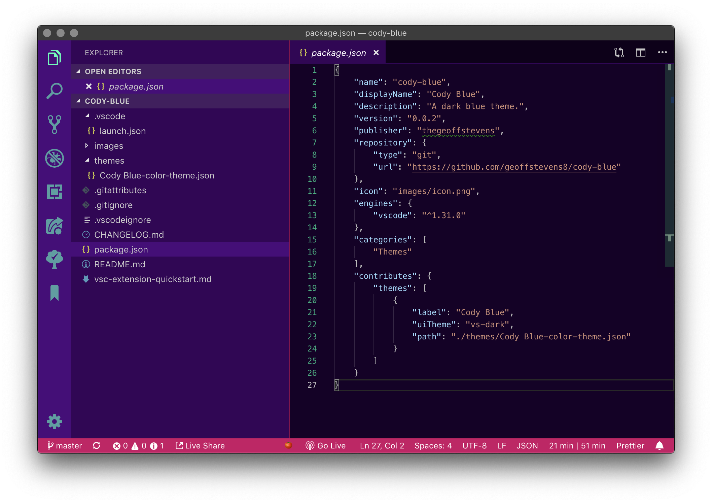

# Best Colorful Themes Pack

The best colorful themes for Visual Studio Code are now available as a single package, so you don't have to install them individually. 

The pack includes: 

* [Shades of Purple](https://marketplace.visualstudio.com/items?itemName=ahmadawais.shades-of-purple)
* [SynthWave](https://marketplace.visualstudio.com/items?itemName=RobbOwen.synthwave-vscode)
* [Code Blue](https://marketplace.visualstudio.com/items?itemName=Sujan.code-blue)
* [Cyberpunk](https://marketplace.visualstudio.com/items?itemName=max-SS.cyberpunk)
* [LaserWave](https://marketplace.visualstudio.com/items?itemName=jaredkent.laserwave)
* [Zeonica](https://marketplace.visualstudio.com/items?itemName=andrewvallette.zeonica)
* [Hipster](https://marketplace.visualstudio.com/items?itemName=ModoNoob.vscode-hipster-theme)
* [Wildberry](https://marketplace.visualstudio.com/items?itemName=joebayer1340.wildberry-theme)
* [Qiita](https://marketplace.visualstudio.com/items?itemName=Increments.qiita)
* [Soft Era](https://marketplace.visualstudio.com/items?itemName=soft-aesthetic.soft-era-theme)

## Theme Breakdown 

### Shades of Purple

 
 

Description. 

  

### SynthWave

 
 

Description 

  

### Code Blue

 
 

Description 

  

### Cyberpunk

 
 

Description 

  

### LaserWave

 
 

Description 

  

### Zeonica

 
 

Description 

  

### Hipster

 
 

Description 

  

### Wildberry

 
 

Description 

  

### Qiita

 
 

Description 

  

### Soft Era

 
 

Description 

  

## Have a suggestion? 

Submit a PR to the [GitHub repo](https://github.com/geoffstevens8/best-light-themes-pack). 
